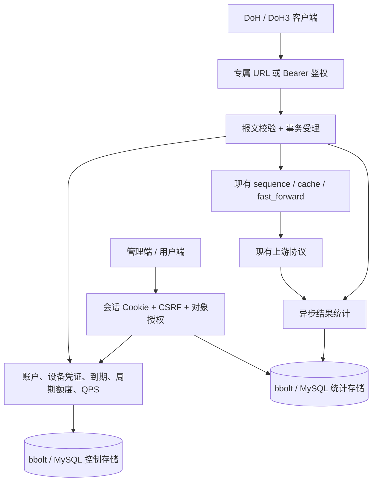

# 多用户 DNS 服务架构

单台服务器运行一个 Mosdns 进程。管理端、用户端和 DNS 服务共享账户状态；DNS 插件、执行链与上游协议保持原有边界。界面以 React / TypeScript 编写，生产资源通过 Go `embed` 打包。

## 模块边界

| 模块 | 职责 |
|---|---|
| `coremain` | 配置、命令行、依赖组装、监听器、关闭顺序 |
| `internal/control` | 密码、会话、设备凭证、额度与 QPS、准确用量、审计、存储维护 |
| `internal/controlapi` | 管理员和用户 API、CSRF、访问范围、旧 API 保护、静态资源 |
| `internal/telemetry` | 有界异步队列、分钟聚合、可选查询明细、上游尝试统计 |
| `pkg/server` | 协议解析与入口；通过回调使用鉴权和受理服务 |
| `pkg/query_context` | 请求只读身份及上游观察器、分支私有的响应与缓存标记 |
| `web` | 管理端、用户端、构建时嵌入的网页资源 |

`internal/control.Service` 和 `internal/telemetry.Service` 隔离存储实现，`coremain` 根据配置创建 bbolt 或 MySQL 后端。`pkg` 不导入 `internal/control`；适配发生在 `coremain`。插件不直接维护用户账户或扣减额度，因此缓存提前返回、fallback 和并行上游不会绕过受理，也不会重复扣额。

## 身份和权限

- 密码通过 Argon2id 保存。面板使用有期限的 HttpOnly 会话 Cookie，写操作同时校验 Origin 和 CSRF；DNS Token 不能用来登录面板。
- DNS 凭证属于一个用户及一个设备，服务端只保存秘密摘要。创建和旋转时一次展示 Token 与专属 URL，之后只能查看元数据或再次旋转。
- 旋转增加凭证版本。入口受理再次校验版本，避免“先鉴权、后旋转、再扣额”的旧身份继续进入执行链。
- 用户 API 的身份取自会话，管理员 API 每次检查角色；服务层再次验证写入对象归属。所有设备共享用户额度和 QPS。
- 禁用账户会阻止面板与 DNS。DNS 服务到期仅阻止 DNS 使用，用户仍可登录查看到期和用量。

## 额度与统计语义

报文有效且账户、凭证、到期、QPS 和额度检查通过后，受理事务同时保存额度与分钟用量，再执行 DNS 链。事务提交表示请求已受理。缓存命中和最终 SERVFAIL 都计一次；客户端重试是新的请求。内部重试、并发、fallback 和缓存后台刷新不再受理。

周期按用户设置的时区及自然日／自然月边界计算。管理员修改额度上限保留已用量；已消费周期不能通过修改周期或时区清零。检测到时间回拨至已处理周期之前时拒绝受理，避免重复获得额度。

准确用量与结果统计分别存储。异步统计队列满或写入失败会记录可观测的丢弃量；进程崩溃可能丢失尚未落盘的结果统计，但已提交的额度保持。`dropped` 仅覆盖当前进程观测到的丢弃事件，不能用它推导历史数据完整。结果统计按分钟聚合，P95 为直方图桶上界估算。上游尝试次数包含内部并发及后台刷新，可能大于客户端查询次数。

bbolt 把控制与统计放在两个本地文件中。MySQL 使用规范化表：控制事务锁定用户和凭证行后完成额度、令牌桶与用量写入；统计通过有界队列批量 `UPSERT`。两个后端保持相同的服务接口和 API 语义，迁移工具在服务停止后把 bbolt 数据导入空的 MySQL 表组。

首版所有用户使用同一 DNS 解析策略和共享缓存。未来加入用户专属过滤、ECS 或不同上游策略时，必须先隔离缓存键或缓存实例，不能仅在缓存之后分流。

## 页面范围

管理端提供用户开通／停用、到期与配额、设备凭证、全局和单用户用量、响应统计、审计及安全的系统概览。用户端提供自身额度、用量、设备凭证和密码管理。

系统概览只导出经过白名单筛选的配置摘要。DNS YAML 的在线修改、热重载、支付、自助注册和多实例共享配额不属于首版。

接口字段见 [API 契约](control-api.md)，构建方法见 [构建说明](building.md)，批次审核和验证结果见 [开发审核记录](development-review.md)。
